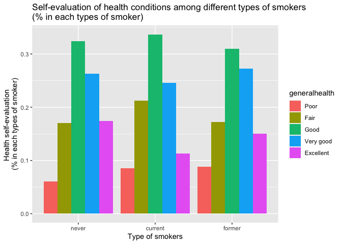
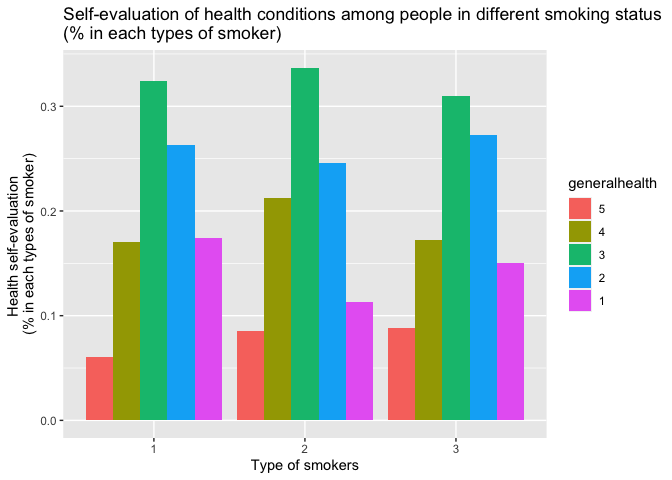
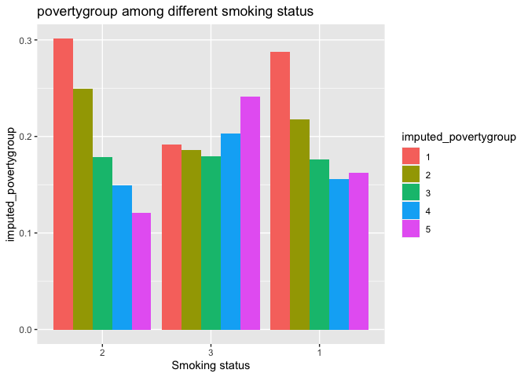
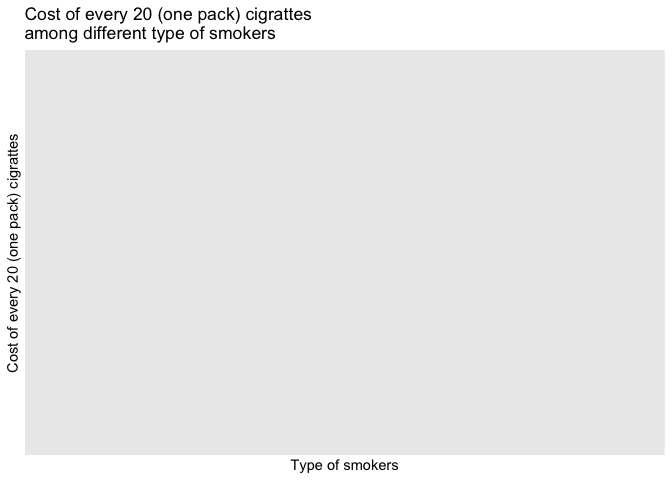
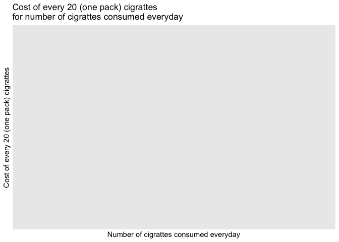

Data exploration2
================
Mengfan Luo
11/11/2021

## Data loading and crude cleaning

We select year 2014-2016 and variables relating to smoking and
insurance.

``` r
chs16 = read_sas("data/chs2016_public.sas7bdat")

chs16_filter = chs16 %>% 
  select(agegroup,generalhealth,insuredgateway16,insure16,insured,insure5,sickadvice16,sickplace,didntgetcare16,smoker,everyday,numberperdaya,cost20cigarettes,imputed_povertygroup ,bmi,child,sex) %>% 
  mutate(year = 2016) %>% 
  rename(insuredgateway = insuredgateway16, insure = insure16,sickadvice = sickadvice16,didntgetcare = didntgetcare16)


chs15 = read_sas("data/chs2015_public.sas7bdat")

chs15_filter = chs15 %>% 
  select(agegroup,generalhealth,insuredgateway15,insure15,insured,insure5,sickadvice15,sickplace,didntgetcare15,smoker,everyday,numberperdaya,cost20cigarettes,imputed_povertygroup ,bmi,child,sex) %>% 
  mutate(year = 2015) %>% 
  rename(insuredgateway = insuredgateway15, insure = insure15,sickadvice = sickadvice15,didntgetcare = didntgetcare15)


chs14 = read_sas("data/chs2014_public.sas7bdat")

chs14_filter = chs14 %>% 
  select(agegroup,generalhealth,insuredgateway14,insure14,insured,insure5,sickadvice14,sickplace,didntgetcare14,smoker,everyday,numberperdaya,cost20cigarettes,imputed_povertygroup ,bmi,child,sex) %>% 
  mutate(year = 2014) %>% 
  rename(insuredgateway = insuredgateway14, insure = insure14,sickadvice = sickadvice14,didntgetcare = didntgetcare14)


chs_14_16 = bind_rows(chs14_filter,chs15_filter,chs16_filter)
```

``` r
dataset_update = chs_14_16 %>% 
  select(agegroup,insure,smoker,everyday,numberperdaya,cost20cigarettes,generalhealth,imputed_povertygroup,bmi,child,sex) %>% 
  mutate(numberperdaya = round(numberperdaya,1),
         imputed_povertygroup = factor(imputed_povertygroup),
         child = factor(child,levels = c(1,2),labels = c("yes","no")),
         sex = factor(sex,labels = c("male","female")),
         insure = factor(insure,levels = c(1,2,3,4,5,6,7),labels = c("Employer","Self-purchase","Medicare", "Medicaid/Family Health+", "Milit/CHAMPUS/Tricare", "COBRA/Other", "Uninsured")),
         generalhealth = factor(generalhealth,levels = c(5,4,3,2,1), labels = c("Poor","Fair","Good","Very good","Excellent")),
         smoker = factor(smoker,levels = c(1,2,3),labels = c("never","current","former")),
         everyday = factor(everyday),
         agegroup = factor(agegroup,ordered = TRUE,labels = c("18-24yrs","25-44yrs", "45-64yrs", "65+yrs")),
         imputed_povertygroup = factor(imputed_povertygroup,levels = c(1,2,3,4,5),labels = c("<100% FPL","100 - <200% FPL","200 - <400% FPL","400 - <600% FPL",">600% FPL"))
         )
write_csv(dataset_basic,"data/dataset_update.csv")
```

``` r
dataset_basic = chs_14_16 %>% 
  select(agegroup,insure,smoker,everyday,numberperdaya,cost20cigarettes,generalhealth,imputed_povertygroup,bmi,child,sex) %>% 
  mutate(numberperdaya = round(numberperdaya,1),
         imputed_povertygroup = factor(imputed_povertygroup),
         child = factor(child,levels = c(1,2)),
         sex = factor(sex),
         insure = factor(insure,levels = c(1,2,3,4,5,6,7)),
         generalhealth = factor(generalhealth,levels = c(5,4,3,2,1)),
         smoker = factor(smoker,levels = c(1,2,3)),
         everyday = factor(everyday),
         agegroup = factor(agegroup,ordered = TRUE),
         imputed_povertygroup = factor(imputed_povertygroup,levels = c(1,2,3,4,5))
         )
write_csv(dataset_basic,"data/dataset_basic.csv")
```

## About smoking

``` r
smoke_df = dataset_basic %>% 
  select(agegroup,smoker,everyday,numberperdaya,cost20cigarettes,generalhealth,imputed_povertygroup,bmi,child,sex) %>% 
  drop_na(smoker) %>% 
  mutate(
         smoker_cat = case_when(
           numberperdaya <= 10 ~ 1,
           (numberperdaya > 10) & (numberperdaya <= 20) ~2,
           numberperdaya > 20 ~ 3),
         smoker_cat = factor(smoker_cat,levels = c(1,2,3),labels = c("light","normal","heavy")))
```

-   Age distribution among people in different smoking status

``` r
smoke_df %>% 
  drop_na(agegroup) %>% 
  group_by(agegroup,smoker) %>% 
  summarize(
    count = n(),
  ) %>% 
  mutate(smoker = fct_reorder(smoker,count)) %>% 
  ggplot(aes(x = smoker, y = count, fill = agegroup)) + 
  geom_bar(stat = "identity",position = "dodge") +
    labs(
      x = 'Smoking status',
      y = 'Number of smokers',
      title = 'Age distribution among people in different smoking status')
```

    ## `summarise()` has grouped output by 'agegroup'. You can override using the `.groups` argument.

<!-- -->

-   Self-evaluation of health conditions among people in different
    smoking status

``` r
smokegroup_count = smoke_df %>% 
  drop_na(smoker) %>% 
  group_by(smoker) %>% 
  summarize(
    smokegroup_count = n()) %>% 
  pull()

smoke_df %>% 
  drop_na(generalhealth) %>% 
  group_by(generalhealth,smoker) %>% 
  summarize(
    count = n())%>% 
  mutate(smokegroup_count = smokegroup_count,
         health_percent = count/smokegroup_count)%>% 
  ggplot(aes(x = smoker, y = health_percent, fill = generalhealth)) + 
  geom_bar(stat = "identity",position = "dodge") +
    labs(
      x = 'Type of smokers',
      y = 'Health self-evaluation \n(% in each types of smoker)',
      title = 'Self-evaluation of health conditions among people in different smoking status\n(% in each types of smoker)')
```

    ## `summarise()` has grouped output by 'generalhealth'. You can override using the `.groups` argument.

<!-- -->

``` r
smoke_df %>% 
  drop_na(imputed_povertygroup) %>% 
  group_by(imputed_povertygroup,smoker) %>% 
  summarize(
    count = n(),
  ) %>% 
  mutate(
    smokegroup_count = smokegroup_count,
    poverty_percent = count/smokegroup_count,
    smoker = fct_reorder(smoker,count)) %>% 
  ggplot(aes(x = smoker, y = poverty_percent, fill = imputed_povertygroup)) + 
  geom_bar(stat = "identity",position = "dodge") +
    labs(
      x = 'Smoking status',
      y = 'imputed_povertygroup',
      title = 'povertygroup among different smoking status')
```

    ## `summarise()` has grouped output by 'imputed_povertygroup'. You can override using the `.groups` argument.

<!-- -->

For `never` and `former` smokers, no data for variables `everyday`,
`numberperdaya`, `cost20cigarettes`, so next we focus on the current
smokers.

-   Cost and number of daily consumption

``` r
current_smoker = smoke_df %>% filter(smoker == "current")

current_smoker %>%
  ggplot(aes(x = smoker_cat, y = cost20cigarettes, fill = smoker_cat))+
  geom_violin() +
    labs(
      x = 'Type of smokers',
      y = 'Cost of every 20 (one pack) cigrattes',
      title = 'Cost of every 20 (one pack) cigrattes\namong different type of smokers')
```

<!-- -->

``` r
current_smoker %>% 
  ggplot(aes(x = numberperdaya, y = cost20cigarettes,color = smoker_cat))+
  geom_point(alpha = .5,size = 3) +
  #facet_grid(.~smoker_cat,scales = "free") +
    labs(
      x = 'Number of cigrattes consumed everyday',
      y = 'Cost of every 20 (one pack) cigrattes',
      title = 'Cost of every 20 (one pack) cigrattes\nfor number of cigrattes consumed everyday')
```

<!-- -->
