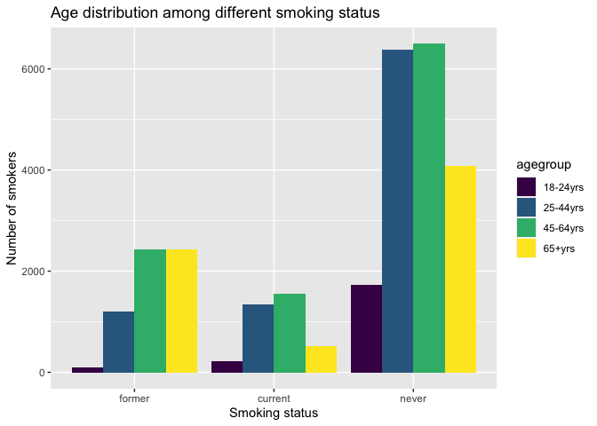
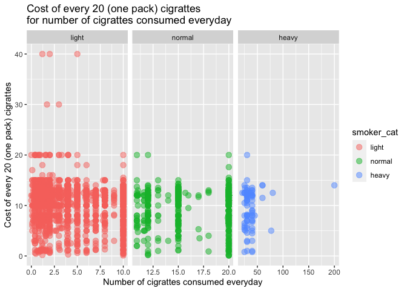

Data exploration2
================
Mengfan Luo
11/11/2021

### Sample code given with the source data

    rm(list=ls(all=TRUE))
    library("haven")
    library("survey")
    library(dplyr)
    require(data.table)
    chs17<-read_sas("data/chs2017_public.sas7bdat")

    #city-wide estimates
    chs<-transform(chs17,strata=as.character(strata),all=as.factor(survey))

    #define the survey
    chs.dsgn<-svydesign(ids = ~1,strata = ~strata,weights=~wt18_dual,data = chs,nest = TRUE,na.rm=TRUE )
    #age adjusted survey
    pop.agecat4=c(0.128810, 0.401725, 0.299194, 0.170271)
    chs.stdes<-svystandardize(subset(chs.dsgn,diabetes17>0 ),by=~agegroup,over=~all,population=pop.agecat4,excluding.missing =~ agegroup+ ~all)

    #weighted N
    aggregate(chs17$wt18_dual, by=list(Category=chs17$diabetes17), FUN=sum)

    #crude prevalance estimates
    svyby(~diabetes17==1,~all,subset(chs.dsgn,diabetes17>0),svyciprop,vartype = "ci",method="xlogit",df=degf(chs.dsgn))
    svyby(~diabetes17==2,~all,subset(chs.dsgn,diabetes17>0),svyciprop,vartype = "ci",method="xlogit",df=degf(chs.dsgn))

    #age adjusted prevalance estimates

    svyby(~diabetes17==1,~all,chs.stdes,svyciprop,vartype = "ci",method="xlogit",df=degf(chs.dsgn))
    svyby(~diabetes17==2,~all,chs.stdes,svyciprop,vartype = "ci",method="xlogit",df=degf(chs.dsgn))

    #estimate by sex
    chs<-transform(chs17,strata=as.character(strata),allsex2=as.factor(sex))

    #define the survey
    chs.dsgn<-svydesign(ids = ~1,strata = ~strata,weights=~wt18_dual,data = chs,nest = TRUE,na.rm=TRUE )
    #age adjusted survey
    pop.agecat4=c(0.128810, 0.401725, 0.299194, 0.170271)
    chs.stdes<-svystandardize(subset(chs.dsgn,diabetes17>0 ),by=~agegroup,over=~allsex2,population=pop.agecat4,excluding.missing =~ agegroup+ ~allsex2)

    #crude prevalance estimates
    svyby(~diabetes17==1,~allsex2,subset(chs.dsgn,diabetes17>0),svyciprop,vartype = "ci",method="xlogit",df=degf(chs.dsgn))
    svyby(~diabetes17==2,~allsex2,subset(chs.dsgn,diabetes17>0),svyciprop,vartype = "ci",method="xlogit",df=degf(chs.dsgn))


    #age adjusted prevalance estimates

    svyby(~diabetes17==1,~allsex2,chs.stdes,svyciprop,vartype = "ci",method="xlogit",df=degf(chs.dsgn))
    svyby(~diabetes17==2,~allsex2,chs.stdes,svyciprop,vartype = "ci",method="xlogit",df=degf(chs.dsgn))

## Data loading and crude cleaning

We select year 2014-2016 and variables relating to smoking and
insurance.

``` r
chs16 = read_sas("data/chs2016_public.sas7bdat")

chs16_filter = chs16 %>% 
  select(agegroup,generalhealth,insuredgateway16,insure16,insured,insure5,sickadvice16,sickplace,didntgetcare16,smoker,everyday,numberperdaya,cost20cigarettes,imputed_povertygroup,fluvaccineshot) %>% 
  mutate(year = 2016) %>% 
  rename(insuredgateway = insuredgateway16, insure = insure16,sickadvice = sickadvice16,didntgetcare = didntgetcare16)


chs15 = read_sas("data/chs2015_public.sas7bdat")

chs15_filter = chs15 %>% 
  select(agegroup,generalhealth,insuredgateway15,insure15,insured,insure5,sickadvice15,sickplace,didntgetcare15,smoker,everyday,numberperdaya,cost20cigarettes,imputed_povertygroup,fluvaccineshot) %>% 
  mutate(year = 2015) %>% 
  rename(insuredgateway = insuredgateway15, insure = insure15,sickadvice = sickadvice15,didntgetcare = didntgetcare15)


chs14 = read_sas("data/chs2014_public.sas7bdat")

chs14_filter = chs14 %>% 
  select(agegroup,generalhealth,insuredgateway14,insure14,insured,insure5,sickadvice14,sickplace,didntgetcare14,smoker,everyday,numberperdaya,cost20cigarettes,imputed_povertygroup,fluvaccineshot) %>% 
  mutate(year = 2014) %>% 
  rename(insuredgateway = insuredgateway14, insure = insure14,sickadvice = sickadvice14,didntgetcare = didntgetcare14)


chs_14_16 = bind_rows(chs14_filter,chs15_filter,chs16_filter)
```

``` r
dataset_basic = chs_14_16 %>% 
  select(agegroup,insuredgateway,insure,sickadvice,sickadvice,didntgetcare,smoker,everyday,numberperdaya,cost20cigarettes,generalhealth,fluvaccineshot,imputed_povertygroup) %>% 
  mutate(numberperdaya = round(numberperdaya,1))
```

``` r
smoke_df = dataset_basic %>% 
  select(agegroup,smoker,everyday,numberperdaya,cost20cigarettes,generalhealth,fluvaccineshot,imputed_povertygroup) %>% 
  drop_na(smoker) %>% 
  mutate(smoker = factor(smoker,levels = c(1,2,3),labels = c("never","current","former")),
         everyday = factor(everyday),
         agegroup = factor(agegroup,ordered = TRUE,labels = c("18-24yrs","25-44yrs", "45-64yrs", "65+yrs")),
         smoker_cat = case_when(
           numberperdaya <= 10 ~ 1,
           (numberperdaya > 10) & (numberperdaya <= 20) ~2,
           numberperdaya > 20 ~ 3),
         smoker_cat = factor(smoker_cat,levels = c(1,2,3),labels = c("light","normal","heavy")),
         generalhealth = factor(generalhealth,levels = c(5,4,3,2,1), labels = c("Poor","Fair","Good","Very good","Excellent")),
         fluvaccineshot = factor(fluvaccineshot, levels = c(1,2), labels = c("yes","no")),
         imputed_povertygroup = factor(imputed_povertygroup)
         
         )

skimr::skim(smoke_df)
```

|                                                  |           |
|:-------------------------------------------------|:----------|
| Name                                             | smoke\_df |
| Number of rows                                   | 28573     |
| Number of columns                                | 9         |
| \_\_\_\_\_\_\_\_\_\_\_\_\_\_\_\_\_\_\_\_\_\_\_   |           |
| Column type frequency:                           |           |
| factor                                           | 7         |
| numeric                                          | 2         |
| \_\_\_\_\_\_\_\_\_\_\_\_\_\_\_\_\_\_\_\_\_\_\_\_ |           |
| Group variables                                  | None      |

Data summary

**Variable type: factor**

| skim\_variable        | n\_missing | complete\_rate | ordered | n\_unique | top\_counts                                 |
|:----------------------|-----------:|---------------:|:--------|----------:|:--------------------------------------------|
| agegroup              |         61 |           1.00 | TRUE    |         4 | 45-: 10479, 25-: 8940, 65+: 7040, 18-: 2053 |
| smoker                |          0 |           1.00 | FALSE   |         3 | nev: 18729, for: 6188, cur: 3656            |
| everyday              |      24917 |           0.13 | FALSE   |         2 | 1: 2251, 2: 1405                            |
| generalhealth         |        212 |           0.99 | FALSE   |         5 | Goo: 9219, Ver: 7505, Fai: 5037, Exc: 4614  |
| fluvaccineshot        |        160 |           0.99 | FALSE   |         2 | no: 14824, yes: 13589                       |
| imputed\_povertygroup |          0 |           1.00 | FALSE   |         5 | 1: 7675, 2: 6135, 3: 5063, 5: 4976          |
| smoker\_cat           |      24917 |           0.13 | FALSE   |         3 | lig: 2853, nor: 708, hea: 95                |

**Variable type: numeric**

| skim\_variable   | n\_missing | complete\_rate |  mean |   sd |  p0 | p25 | p50 |  p75 | p100 | hist  |
|:-----------------|-----------:|---------------:|------:|-----:|----:|----:|----:|-----:|-----:|:------|
| numberperdaya    |      24917 |           0.13 |  7.70 | 8.33 | 0.0 | 1.6 |   5 | 10.0 |  200 | ▇▁▁▁▁ |
| cost20cigarettes |      25517 |           0.11 | 10.29 | 3.45 | 0.1 | 8.0 |  11 | 12.5 |   40 | ▃▇▁▁▁ |

-   Age distribution among different types of smokers

``` r
smoke_df %>% 
  drop_na(agegroup) %>% 
  group_by(agegroup,smoker) %>% 
  summarize(
    count = n(),
  ) %>% 
  mutate(smoker = fct_reorder(smoker,count)) %>% 
  ggplot(aes(x = smoker, y = count, fill = agegroup)) + 
  geom_bar(stat = "identity",position = "dodge") +
    labs(
      x = 'Smoking status',
      y = 'Number of smokers',
      title = 'Age distribution among different smoking status')
```

    ## `summarise()` has grouped output by 'agegroup'. You can override using the `.groups` argument.

<!-- -->

-   Self-evaluation of health conditions among different types of
    smokers

``` r
smokegroup_count = smoke_df %>% 
  drop_na(smoker) %>% 
  group_by(smoker) %>% 
  summarize(
    smokegroup_count = n()) %>% 
  pull()

smoke_df %>% 
  drop_na(generalhealth) %>% 
  group_by(generalhealth,smoker) %>% 
  summarize(
    count = n())%>% 
  mutate(smokegroup_count = smokegroup_count,
         health_percent = count/smokegroup_count)%>% 
  ggplot(aes(x = smoker, y = health_percent, fill = generalhealth)) + 
  geom_bar(stat = "identity",position = "dodge") +
    labs(
      x = 'Type of smokers',
      y = 'Health self-evaluation \n(% in each types of smoker)',
      title = 'Self-evaluation of health conditions among different types of smokers\n(% in each types of smoker)')
```

    ## `summarise()` has grouped output by 'generalhealth'. You can override using the `.groups` argument.

<!-- -->

``` r
smoke_df %>% 
  drop_na(imputed_povertygroup) %>% 
  group_by(imputed_povertygroup,smoker) %>% 
  summarize(
    count = n(),
  ) %>% 
  mutate(
    smokegroup_count = smokegroup_count,
    poverty_percent = count/smokegroup_count,
    smoker = fct_reorder(smoker,count)) %>% 
  ggplot(aes(x = smoker, y = poverty_percent, fill = imputed_povertygroup)) + 
  geom_bar(stat = "identity",position = "dodge") +
    labs(
      x = 'Smoking status',
      y = 'imputed_povertygroup',
      title = 'povertygroup among different smoking status')
```

    ## `summarise()` has grouped output by 'imputed_povertygroup'. You can override using the `.groups` argument.

<!-- -->

For `never` and `former` smokers, no data for variables `everyday`,
`numberperdaya`, `cost20cigarettes`, so next we focus on the current
smokers.

-   Cost and number of daily consumption

``` r
current_smoker = smoke_df %>% filter(smoker == "current")

current_smoker %>%
  ggplot(aes(x = smoker_cat, y = cost20cigarettes, fill = smoker_cat))+
  geom_violin() +
    labs(
      x = 'Type of smokers',
      y = 'Cost of every 20 (one pack) cigrattes',
      title = 'Cost of every 20 (one pack) cigrattes\namong different type of smokers')
```

    ## Warning: Removed 600 rows containing non-finite values (stat_ydensity).

<!-- -->

``` r
current_smoker %>% 
  ggplot(aes(x = numberperdaya, y = cost20cigarettes,color = smoker_cat))+
  geom_point(alpha = .5,size = 3) +
  facet_grid(.~smoker_cat,scales = "free") +
    labs(
      x = 'Number of cigrattes consumed everyday',
      y = 'Cost of every 20 (one pack) cigrattes',
      title = 'Cost of every 20 (one pack) cigrattes\nfor number of cigrattes consumed everyday')
```

    ## Warning: Removed 600 rows containing missing values (geom_point).

<!-- -->

Chi-squared test for `insure` and 1. Flu

``` r
analyse_flu_insurancetype = 
  dataset_basic %>%
  drop_na(fluvaccineshot,insure) %>% 
  mutate(fluvaccineshot = factor(fluvaccineshot,levels = c(1,2),labels = c("Yes","No"))) %>% 
  mutate(insure = factor(insure,levels = c(1,2,3,4,5,6,7),labels = c("Employer","Self-purchase","Medicare", "Medicaid/Family Health+", "Milit/CHAMPUS/Tricare", "COBRA/Other", "Uninsured"))) %>% 
  group_by(fluvaccineshot,insure) %>% 
  summarize(n = n())
```

    ## `summarise()` has grouped output by 'fluvaccineshot'. You can override using the `.groups` argument.

``` r
test_data_flu_insurance = analyse_flu_insurancetype %>% 
  pivot_wider(
  names_from = "insure", 
  values_from = "n")
```

``` r
chisq.test(test_data_flu_insurance[-1])
```

    ## 
    ##  Pearson's Chi-squared test
    ## 
    ## data:  test_data_flu_insurance[-1]
    ## X-squared = 1170.3, df = 6, p-value < 2.2e-16

2.  

``` r
analyse_poverty_insurancetype = 
  dataset_basic %>%
  drop_na(imputed_povertygroup,insure) %>% 
  mutate(imputed_povertygroup = factor(imputed_povertygroup,levels = c(1,2,3,4,5))) %>% 
  mutate(insure = factor(insure,levels = c(1,2,3,4,5,6,7),labels = c("Employer","Self-purchase","Medicare", "Medicaid/Family Health+", "Milit/CHAMPUS/Tricare", "COBRA/Other", "Uninsured"))) %>% 
  group_by(imputed_povertygroup,insure) %>% 
  summarize(n = n())
```

    ## `summarise()` has grouped output by 'imputed_povertygroup'. You can override using the `.groups` argument.

``` r
test_data_poverty_insurance = analyse_poverty_insurancetype %>% 
  pivot_wider(
  names_from = "insure", 
  values_from = "n")
```

``` r
chisq.test(test_data_poverty_insurance[-1])
```

    ## 
    ##  Pearson's Chi-squared test
    ## 
    ## data:  test_data_poverty_insurance[-1]
    ## X-squared = 9907.9, df = 24, p-value < 2.2e-16
