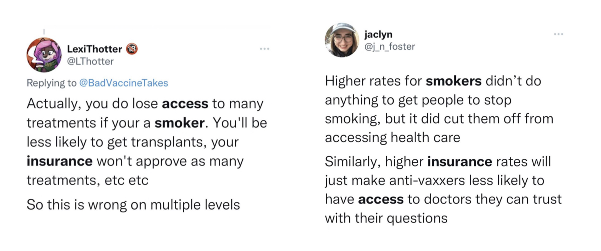

 

 A shot of non-smoking sign in the Columbia University Irving Medical Center  

 

## Motivation and Research question

It is known that the health insurance companies stratify smokers and non-smokers and assign different insurance prices according to smoking status. Intuitively, we think that as price increase, the smoker would less likely to purchase health insurance. 

Image below shows the portrait of the New York medical insurance. We noticed that there are very large amount of New-Yorkers who are not insured. 

Image source: https://www.ehealthinsurance.com/new-york-health-insurance 

Since health insurance is vital for individual's well-being, we are interested in exploring if smokers in NYC tend to get insurance, and what type of insurance they prefer. Mapping of health consulting centers and health insurance carriers locations in NYC, along with their contact information and operation hours, are also provided for readers who need more information for insurance.

 

## Datasets

Our main dataset is from the [Community Health Survey Public Use Data](https://www1.nyc.gov/site/doh/data/data-sets/community-health-survey-public-use-data.page). This dataset contains survey questions regarding smoking and health insurance. Detailed information of the chosen variables can be found [here](data_cleaning_notes.html).

We also utilized [Primary Care Access and Planning - Health Insurance Enrollment](https://data.cityofnewyork.us/Health/Primary-Care-Access-and-Planning-Health-Insurance-/gfej-by6h) for mapping of health consulting center. In addition, we collected locations of health insurance carriers in NYC manually and created interactive mapping of these carriers.

 

## Website overview

In this website, you will find:

* [Data exploration](data-exploration1.html) of our targeted datasets.

* [Model](model_building.html) build using cleaned datasets.

* [Analysis and discussion](.html) of our finding.

* [Mapping](mapping.html) of health consulting centers and health insurance carriers locations in NYC, along with their contact information and operation hours.

* Final formatted [Report](report.html) of our research

You can also reach to us by clicking the email icon on top right corner of the website. Our github page can also be found be clicking the github icon.

 

## Collaborators

* Jing Lyu
* Mengfan Luo
* Yushan Wang
* Yiqun Jin

We are Biostatistics students from Columbia University Mailman School of Public Health. This is a project for the course P8105 Data Science.

